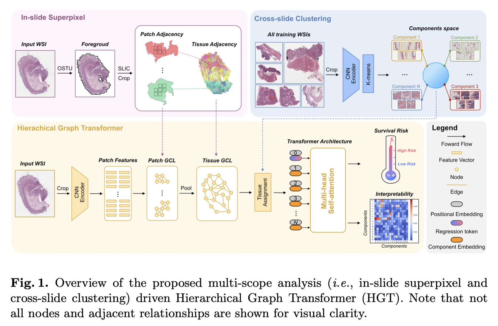

## Multi-scope Analysis Driven Hierarchical Graph Transformer for Whole Slide Image based Cancer Survival Prediction

<div align=left></div>

## Installation
Clone the repo:
```bash
git clone https://github.com/Baeksweety/HGTHGT  && cd HGTHGT
```
Create a conda environment and activate it:
```bash
conda create -n env python=3.8
conda activate env
pip install -r requirements.txt
```

## Data Preprocess
***generate_superpixel.py*** shows how to generate merged superpixels of whole slide images and ***graph_construction.ipynb*** shows how to transform a  histological image into the hierarchical graphs. After the data processing is completed, put all hierarchical graphs into a folder. The form is as follows:
```bash
PYG_Data
   └── Dataset
          ├── pyg_data_1.pt
          ├── pyg_data_2.pt
                    :
          └── pyg_data_n.pt
```

## Training
First, setting the data path, data splits and hyperparameters in the file ***train.py***. Then, experiments can be run using the following command-line:
```bash
cd train
python train.py
```

## Saved models
We provide a 5-fold checkpoint for each dataset, which performing as:
| Dataset | CI |
| ----- |:--------:|
| CRC   | 0.607 |
| TCGA_LIHC | 0.657 |
| TCGA_KIRC | 0.646 |


## Inference
Using the following command-line for model inference and result statistics:
```bash
cd inference
python inference_<experiments>.py
```


## More Info
- Our implementation refers the following publicly available codes. 
  - [Pytorch Geometric](https://github.com/pyg-team/pytorch_geometric)--Fey M, Lenssen J E. Fast graph representation learning with PyTorch Geometric[J]. arXiv preprint arXiv:1903.02428, 2019.
  - [Histocartography](https://github.com/histocartography/histocartography)--Jaume G, Pati P, Anklin V, et al. HistoCartography: A toolkit for graph analytics in digital pathology[C]//MICCAI Workshop on Computational Pathology. PMLR, 2021: 117-128.
  - [Hact-net](https://github.com/PushpakPati/hact-net)--Pati P, Jaume G, Foncubierta-Rodríguez A, et al. Hierarchical graph representations in digital pathology[J]. Medical image analysis, 2022, 75: 102264.
  - [ViT Pytorch](https://github.com/lukemelas/PyTorch-Pretrained-ViT)--Dosovitskiy A, Beyer L, Kolesnikov A, et al. An Image is Worth 16x16 Words: Transformers for Image Recognition at Scale[C]//International Conference on Learning Representations. 2020.
